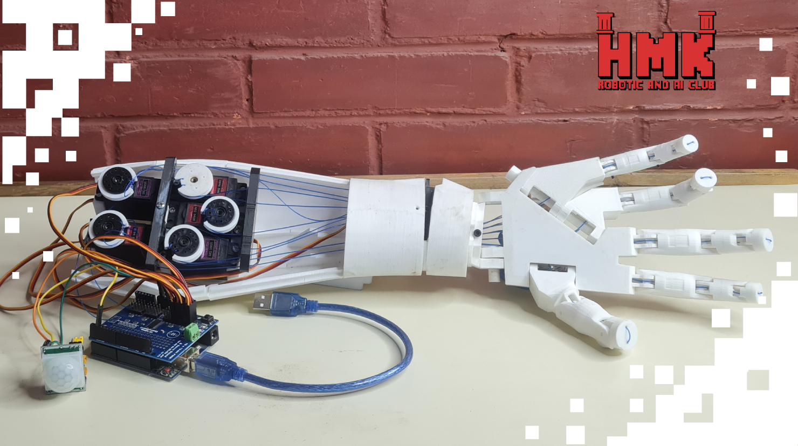

# ✋🤖 Rock-Paper-Scissors Robot

## 📅 Project Timeline & Context

- **Event:** FMEE 2025 – **AI & Robotics Club** Open Day
- **Date:** November 10–11–12, 2025

---

## 💡 Project Overview

An interactive **Rock-Paper-Scissors** game where the visitor plays against a **robotic arm** that mimics human hand movements.  
Using **computer vision**, the camera detects the user’s hand gesture, and the robotic arm responds by selecting and performing its move (rock, paper, or scissors) mechanically.

This project demonstrate a hybrid interactive experience that blends **simple sensing** with **advanced gesture technology**.  
The robot can play in two different modes:

1. **Simple Mode:** A PIR motion sensor triggers randomized robotic moves.  
2. **Advanced Mode:** A Leap Motion Controller detects the player’s hand gesture and the robot responds intelligently.

A microcontroller drives the robot’s mechanical movement, while software interprets gestures and decides the robot’s move.  
The result: a flexible platform that showcases both simple sensor-based behavior and high-precision 3D motion tracking.

---

## ⚙️ Components and Parts Used

### 🛠 Hardware
- 🧠 Raspberry Pi – handles image processing and gesture recognition
- 🧠 **Arduino** – controls servo movements for the robotic hand  
- ✋ **Leap Motion Controller** – detects hand gestures in Advanced Mode  
- 👀 **PIR Motion Sensor** – triggers random moves in Simple Mode  
- 💪 **Servo Motors** – perform robotic hand gestures  
- 🔌 **Servo Motor Driver / Power Module**  
- 📦 **Robotic Hand / Arm Mechanism**  

---

## 💻 Software and Tools Used
- 🐍 **Python** – main programming language for image processing
- **Leap Motion SDK** – gesture tracking and data processing  
- 👁️ **OpenCV** – for image processing using computer vision  
- 🔧 **Arduino IDE** – for programming and controlling the robotic arm

---

## 👨‍💻 Contributors:

Special thanks to :

- **Shahd Alkhawam** [LinkedIn](https://www.linkedin.com/in/shahd-alkhawam-1b98a6373/)
 
- **Ayman Bakleh** [LinkedIn](https://www.linkedin.com/in/aymanbakleh/)
---

### 🏁 Future Improvements

- Add full AI opponent logic to predict player patterns  
- Improve gesture detection accuracy and response time  
- Add RGB indicators or a display for game feedback  
- Integrate sound effects or voice responses  
- Develop a score-tracking interface  

---

### 📸 Demo

**Coming soon!**

---

**Made with ❤️ using Raspberry Pi, Python, and Arduino.**

